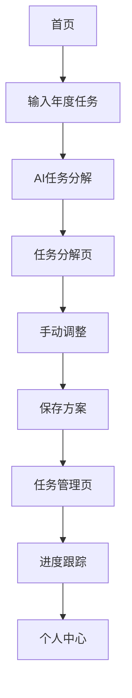

## 1. 产品概述
AI任务分解工具是一个智能化的任务管理系统，能够将用户输入的年度目标自动拆解为月度计划、周计划和每日任务。通过AI算法优化任务分配，帮助用户更好地管理时间和完成目标。

适用于需要长期规划和任务管理的个人用户、项目经理、学生等群体，解决任务规划不合理、执行效率低下的问题。

## 2. 核心功能

### 2.1 用户角色
| 角色 | 注册方式 | 核心权限 |
|------|----------|----------|
| 普通用户 | 邮箱注册 | 创建任务、查看分解结果、编辑任务 |
| 高级用户 | 付费升级 | AI智能优化、历史数据分析、导出功能 |

### 2.2 功能模块
任务分解工具包含以下核心页面：
1. **首页**: 任务输入、年度目标设定、快速开始引导
2. **任务分解页**: 层级展示（年|月|周|日）、AI优化建议、手动调整
3. **任务管理页**: 任务列表、进度跟踪、完成情况统计
4. **个人中心**: 用户信息、历史任务、设置偏好

### 2.3 页面详情
| 页面名称 | 模块名称 | 功能描述 |
|----------|----------|----------|
| 首页 | 任务输入区 | 输入年度目标任务，支持文本描述和关键词识别 |
| 首页 | AI快速分解 | 一键生成全年任务分解方案 |
| 首页 | 历史任务 | 展示最近分解的任务记录 |
| 任务分解页 | 层级展示 | 树状结构展示年→月→周→日任务分解 |
| 任务分解页 | AI优化建议 | 根据任务特性提供时间分配和优先级建议 |
| 任务分解页 | 手动调整 | 支持拖拽调整任务顺序、修改时间安排 |
| 任务管理页 | 任务列表 | 按时间顺序展示所有分解后的任务 |
| 任务管理页 | 进度跟踪 | 标记任务完成状态，显示完成百分比 |
| 任务管理页 | 统计图表 | 展示任务完成情况的时间分布图表 |
| 个人中心 | 用户信息 | 显示用户名、注册时间、会员状态 |
| 个人中心 | 历史任务 | 查看所有历史分解记录和完成情况 |
| 个人中心 | 偏好设置 | 设置任务提醒、界面主题、语言等 |

## 3. 核心流程
用户操作流程：
1. 用户访问首页，输入年度目标任务
2. 点击AI分解按钮，系统自动生成层级任务分解
3. 在任务分解页查看和调整分解结果
4. 保存分解方案，进入任务管理页跟踪执行
5. 每日更新任务完成状态，系统自动统计进度

## 4. 用户界面设计

### 4.1 设计风格
- **主色调**: 深蓝色 (#1E3A8A) 代表专业和可信赖
- **辅助色**: 浅灰色 (#F3F4F6) 和白色提供清晰对比
- **按钮样式**: 圆角矩形，主要操作为实心填充，次要操作为边框样式
- **字体**: 中文使用思源黑体，英文使用Inter，标题18-24px，正文14-16px
- **布局风格**: 卡片式布局，左右分栏设计，左侧导航右侧内容
- **图标风格**: 使用线性图标，简洁现代风格

### 4.2 页面设计概述
| 页面名称 | 模块名称 | UI元素 |
|----------|----------|--------|
| 首页 | 任务输入区 | 大文本输入框带阴影效果，占位符文字提示输入格式 |
| 首页 | AI快速分解 | 渐变蓝色按钮，悬停时有微动画效果 |
| 任务分解页 | 层级展示 | 树状结构使用连接线，可折叠展开，不同层级用颜色区分 |
| 任务分解页 | AI优化建议 | 侧边栏形式，卡片式设计带图标说明 |
| 任务管理页 | 统计图表 | 使用Chart.js图表库，柱状图和饼图结合展示 |
| 个人中心 | 用户信息 | 圆形头像，信息卡片带阴影和圆角 |

### 4.3 响应式设计
采用桌面端优先设计，适配1200px以上屏幕为主，平板和移动端自适应。触摸交互优化，支持手势操作和触摸反馈。

## 5. 技术实现要求
- 前端使用React框架，确保良好的用户体验
- 后端使用Supabase提供数据存储和用户认证
- AI任务分解算法需要调用大语言模型API
- 支持任务数据的导入导出功能
- 提供任务提醒和通知功能