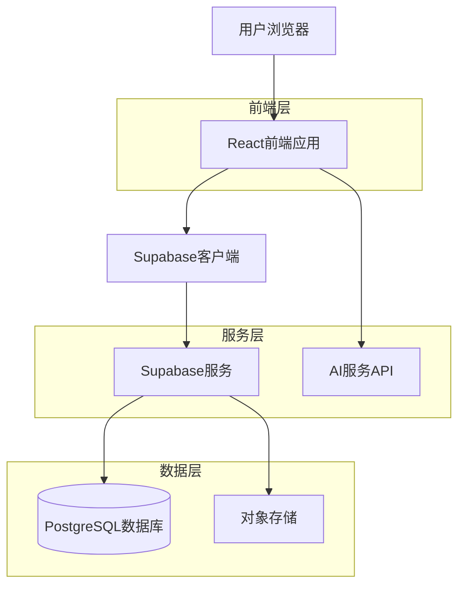
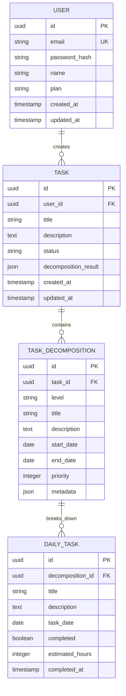

## 1. 架构设计



## 2. 技术描述

- **前端**: React@18 + TailwindCSS@3 + Vite
- **初始化工具**: vite-init
- **后端**: Supabase (提供认证、数据库、存储服务)
- **AI服务**: 集成OpenAI API或类似大语言模型
- **状态管理**: React Context + useReducer
- **路由**: React Router v6
- **UI组件库**: Headless UI + 自定义组件
- **图表库**: Chart.js + react-chartjs-2

## 3. 路由定义

| 路由 | 用途 |
|-------|---------|
| / | 首页，任务输入和快速开始 |
| /decompose | 任务分解页面，展示层级结构 |
| /tasks | 任务管理页面，列表和进度跟踪 |
| /profile | 个人中心，用户信息和设置 |
| /login | 登录页面 |
| /register | 注册页面 |
| /history | 历史任务记录 |

## 4. API定义

### 4.1 核心API接口

**任务分解API**
```
POST /api/tasks/decompose
```

请求参数：
| 参数名 | 参数类型 | 是否必需 | 描述 |
|-----------|-------------|-------------|-------------|
| task_description | string | true | 年度任务描述 |
| preferences | object | false | 用户偏好设置 |

响应参数：
| 参数名 | 参数类型 | 描述 |
|-----------|-------------|-------------|
| task_id | string | 任务唯一标识 |
| decomposition | object | 层级分解结果 |
| status | string | 处理状态 |

示例请求：
```json
{
  "task_description": "学习一门新的编程语言并开发一个完整项目",
  "preferences": {
    "difficulty_level": "medium",
    "time_commitment": "2 hours per day"
  }
}
```

**任务管理API**
```
GET /api/tasks/{task_id}
PUT /api/tasks/{task_id}/status
DELETE /api/tasks/{task_id}
```

## 5. 数据模型

### 5.1 数据模型定义



### 5.2 数据定义语言

**用户表 (users)**
```sql
-- 创建表
CREATE TABLE users (
    id UUID PRIMARY KEY DEFAULT gen_random_uuid(),
    email VARCHAR(255) UNIQUE NOT NULL,
    password_hash VARCHAR(255) NOT NULL,
    name VARCHAR(100) NOT NULL,
    plan VARCHAR(20) DEFAULT 'free' CHECK (plan IN ('free', 'premium')),
    created_at TIMESTAMP WITH TIME ZONE DEFAULT NOW(),
    updated_at TIMESTAMP WITH TIME ZONE DEFAULT NOW()
);

-- 创建索引
CREATE INDEX idx_users_email ON users(email);
CREATE INDEX idx_users_plan ON users(plan);
```

**任务表 (tasks)**
```sql
-- 创建表
CREATE TABLE tasks (
    id UUID PRIMARY KEY DEFAULT gen_random_uuid(),
    user_id UUID NOT NULL REFERENCES users(id) ON DELETE CASCADE,
    title VARCHAR(255) NOT NULL,
    description TEXT,
    status VARCHAR(20) DEFAULT 'pending' CHECK (status IN ('pending', 'processing', 'completed')),
    decomposition_result JSONB,
    created_at TIMESTAMP WITH TIME ZONE DEFAULT NOW(),
    updated_at TIMESTAMP WITH TIME ZONE DEFAULT NOW()
);

-- 创建索引
CREATE INDEX idx_tasks_user_id ON tasks(user_id);
CREATE INDEX idx_tasks_status ON tasks(status);
CREATE INDEX idx_tasks_created_at ON tasks(created_at DESC);
```

**任务分解表 (task_decompositions)**
```sql
-- 创建表
CREATE TABLE task_decompositions (
    id UUID PRIMARY KEY DEFAULT gen_random_uuid(),
    task_id UUID NOT NULL REFERENCES tasks(id) ON DELETE CASCADE,
    level VARCHAR(10) NOT NULL CHECK (level IN ('year', 'month', 'week', 'day')),
    title VARCHAR(255) NOT NULL,
    description TEXT,
    start_date DATE,
    end_date DATE,
    priority INTEGER DEFAULT 1 CHECK (priority >= 1 AND priority <= 5),
    metadata JSONB,
    created_at TIMESTAMP WITH TIME ZONE DEFAULT NOW()
);

-- 创建索引
CREATE INDEX idx_decompositions_task_id ON task_decompositions(task_id);
CREATE INDEX idx_decompositions_level ON task_decompositions(level);
CREATE INDEX idx_decompositions_dates ON task_decompositions(start_date, end_date);
```

**每日任务表 (daily_tasks)**
```sql
-- 创建表
CREATE TABLE daily_tasks (
    id UUID PRIMARY KEY DEFAULT gen_random_uuid(),
    decomposition_id UUID NOT NULL REFERENCES task_decompositions(id) ON DELETE CASCADE,
    title VARCHAR(255) NOT NULL,
    description TEXT,
    task_date DATE NOT NULL,
    completed BOOLEAN DEFAULT FALSE,
    estimated_hours INTEGER DEFAULT 1,
    completed_at TIMESTAMP WITH TIME ZONE,
    created_at TIMESTAMP WITH TIME ZONE DEFAULT NOW()
);

-- 创建索引
CREATE INDEX idx_daily_tasks_decomposition_id ON daily_tasks(decomposition_id);
CREATE INDEX idx_daily_tasks_date ON daily_tasks(task_date);
CREATE INDEX idx_daily_tasks_completed ON daily_tasks(completed);
```

### 5.3 权限设置
```sql
-- 基本权限授予
GRANT SELECT ON users TO anon;
GRANT ALL PRIVILEGES ON users TO authenticated;

GRANT SELECT ON tasks TO anon;
GRANT ALL PRIVILEGES ON tasks TO authenticated;

GRANT SELECT ON task_decompositions TO anon;
GRANT ALL PRIVILEGES ON task_decompositions TO authenticated;

GRANT SELECT ON daily_tasks TO anon;
GRANT ALL PRIVILEGES ON daily_tasks TO authenticated;
```

## 6. AI集成设计

### 6.1 任务分解算法
- 使用大语言模型分析任务描述
- 基于任务类型和复杂度进行时间分配
- 考虑用户偏好和历史数据优化分解方案
- 支持多种任务类型：学习、工作、健身、创作等

### 6.2 API集成
```javascript
// AI分解服务调用示例
const decomposeTask = async (taskDescription, preferences) => {
  const response = await fetch('/api/ai/decompose', {
    method: 'POST',
    headers: {
      'Content-Type': 'application/json',
      'Authorization': `Bearer ${user.token}`
    },
    body: JSON.stringify({
      task: taskDescription,
      preferences: preferences,
      userContext: getUserContext()
    })
  });
  
  return response.json();
};
```

## 7. 性能优化

- 使用React.memo优化组件重渲染
- 实现虚拟滚动处理大量任务列表
- 使用Supabase的实时订阅功能更新任务状态
- 前端缓存机制减少API调用
- 图片和静态资源CDN加速